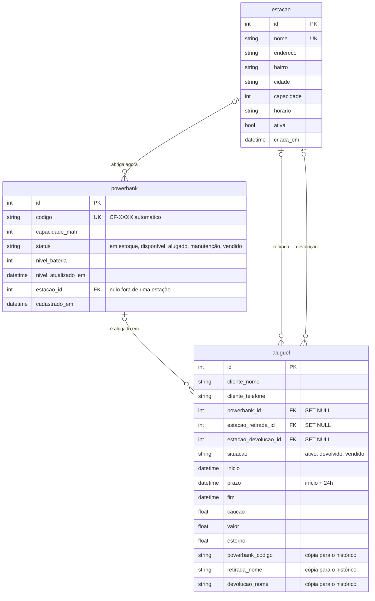

# ⚡ Charge Fácil — API

API REST da **Charge Fácil**, uma rede de estações (totens) de aluguel de power banks.
O cliente **retira um power bank no totem de uma estação e devolve em qualquer outra em até 24h**,
pagando apenas pelo tempo de uso.

Projeto desenvolvido como MVP da disciplina **Desenvolvimento Full Stack Básico** (PUC-Rio).
O front-end fica em um repositório separado: https://github.com/aferreira20/charge-facil-front

Apresentação geral do projeto: https://github.com/aferreira20/MVP_AFN-Full-Stack-Basico

---

## 1 - O problema

A bateria do celular acaba justamente quando mais precisamos dela: no aeroporto, no shopping, no metrô.
A Charge Fácil espalha totens de autoatendimento pela cidade para que qualquer pessoa alugue uma bateria
portátil em segundos e siga em frente, sem ficar presa a uma tomada.

## 2 - Funcionalidades

- **Estações**: cadastro, edição, exclusão e busca por nome, bairro ou cidade, com controle de capacidade (slots) e ocupação.
- **Inventário e estoque**:
  - todo power bank novo entra **em estoque**, com código gerado automaticamente (CF-0001, CF-0002...);
  - depois é **alocado em uma estação** com slot livre e pode ser **recolhido ao estoque** para remanejamento;
  - também há manutenção, descarte e **consulta dos power banks vendidos**, com busca por código, comprador ou telefone.
- **Aluguel pelo totem**: a retirada libera automaticamente o power bank **mais carregado** da estação. A devolução pode ser feita em **qualquer estação ativa com slot livre**. O totem localiza o aluguel pelo celular do cliente.
- **Franquia (caução) de R$ 150,00**: é pré-autorizada na retirada.
  - **Devolveu em até 24h?** O cliente paga só o uso e **a diferença é estornada**.
  - **Não devolveu em 24h?** A franquia é cobrada e o aluguel é **convertido em venda**: o power bank sai da frota e vai para o inventário de vendidos.
- **Tarifa de uso**: 5 min de carência, R$ 5,00 na primeira hora, R$ 3,00 por hora adicional e máximo de R$ 25,00.
- **Bateria simulada**: o power bank recarrega 30%/h na estação e descarrega 20%/h em uso. Só é liberado com pelo menos 20% de carga.
- **Dashboard**: ocupação da rede, frota por status, receita de uso e de franquias, estornos, aluguéis perto do prazo e ranking de estações.

## 3 - Tratamento de datas

Cada aluguel guarda `inicio`, `prazo` (início + 24h) e `fim`. A cada consulta, a API converte automaticamente
em venda os aluguéis ativos cujo prazo já passou (`converter_alugueis_vencidos`), usando o próprio prazo como
data da venda. Aluguéis ativos também informam `minutos_restantes` até o fim do prazo.

## 4 - Tecnologias

| Camada | Ferramenta |
|---|---|
| Linguagem | Python 3.10+ |
| Framework web | Flask |
| Documentação | flask-openapi3 (OpenAPI 3 + Swagger UI) |
| Validação | Pydantic |
| Banco de dados | SQLite via SQLAlchemy (ORM) |
| CORS | flask-cors (o front é aberto direto do disco, sem servidor) |

## 5 - Modelo de dados

Três tabelas relacionadas:



### Por que o modelo foi desenhado assim

A premissa da arquitetura é que o cliente **retira o power bank em uma estação e devolve em qualquer outra da rede**.
Isso define as decisões do modelo:

- **O power bank não pertence a uma estação, ele está nela.** A coluna `powerbank.estacao_id` indica só onde o
  power bank está agora. Na devolução ela passa a apontar para a estação onde ele foi entregue, que pode ser
  outra. Fica nula quando o power bank está em estoque, alugado (com o cliente) ou vendido.
- **O aluguel liga duas estações.** A tabela `aluguel` tem duas chaves estrangeiras para `estacao`:
  `estacao_retirada_id` e `estacao_devolucao_id`. Assim o trajeto fica registrado mesmo quando a retirada e a
  devolução acontecem em lugares diferentes. A devolução começa nula e só é preenchida ao devolver. Se o prazo
  de 24h vencer, o aluguel vira venda e ela continua nula.
- **O histórico fica no aluguel.** O `powerbank` guarda só o estado atual. Cada uso vira uma linha em
  `aluguel`, com datas, franquia, valor cobrado e estorno. Um mesmo power bank acumula vários aluguéis
  (relação 1-N), o que permite calcular o ranking de estações e a receita no painel.
- **O histórico sobrevive a exclusões.** As chaves do aluguel usam `ON DELETE SET NULL`, e as colunas
  `powerbank_codigo`, `retirada_nome` e `devolucao_nome` guardam cópias dos nomes (desnormalização proposital).
  Se uma estação ou um power bank for excluído, os aluguéis antigos continuam legíveis.
- **Cardinalidade opcional (`|o`).** Todas as chaves estrangeiras aceitam nulo, porque o power bank circula
  entre estoque, estações e clientes e nem sempre está vinculado a uma estação.

### Campos

- **estacao**: nome (único), endereço, bairro, cidade, capacidade, horário, ativa, criada_em
- **powerbank**: código (único), capacidade em mAh, status (`em estoque`, `disponível`, `alugado`, `manutenção`, `vendido`), nível de bateria, estação atual (nula quando em estoque, alugado ou vendido)
- **aluguel**: cliente, telefone, situação (`ativo`, `devolvido`, `vendido`), início, prazo, fim, franquia, valor cobrado, estorno, estação de retirada e estação de devolução

Na primeira execução o banco é criado em `database/charge_facil.sqlite3` e populado com dados de demonstração:
**6 estações no Rio de Janeiro e em Niterói, 53 power banks alocados, 5 em estoque, histórico de devoluções,
2 power banks vendidos e 3 aluguéis em andamento**. Um desses aluguéis está a menos de 1h do prazo, para demonstrar a conversão em venda.

## 6 - Instalação e execução

> Pré-requisito: **Python 3.10 ou superior** instalado (`python --version`).

6.1. **Clone o repositório** e entre na pasta:
   ```bash
   git clone https://github.com/aferreira20/charge-facil-api.git
   cd charge-facil-api
   ```

6.2. **Crie e ative um ambiente virtual** (recomendado):
   ```bash
   python -m venv venv
   ```
   - Windows (PowerShell): `venv\Scripts\Activate.ps1`
   - Windows (cmd): `venv\Scripts\activate.bat`
   - Linux/macOS: `source venv/bin/activate`

6.3. **Instale as dependências**:
   ```bash
   pip install -r requirements.txt
   ```

6.4. **Inicie a API**:
   ```bash
   python app.py
   ```
   ou, alternativamente:
   ```bash
   python -m flask run --port 5000
   ```
   > Se aparecer *"'flask' não é reconhecido como um comando"*, as dependências não foram instaladas no ambiente virtual ativo: repita o passo 6.3.

6.5. **Acesse a documentação** em [http://127.0.0.1:5000](http://127.0.0.1:5000).
   A raiz redireciona para o Swagger UI (`/openapi/swagger`), onde todas as rotas podem ser testadas.

   Para voltar aos dados de demonstração, pare a API, apague a pasta `database/` e inicie de novo.

## 7 - Rotas

| Método | Rota | Descrição | Status |
|---|---|---|---|
| GET | `/estacoes` | Lista estações (filtros `busca` e `apenas_ativas`) | 200 |
| GET | `/estacoes/{id}` | Detalhe da estação com seus power banks | 200, 404 |
| POST | `/estacoes` | Cadastra estação | 201, 409, 422 |
| PUT | `/estacoes/{id}` | Atualiza estação | 200, 404, 409, 422 |
| DELETE | `/estacoes/{id}` | Remove estação vazia | 200, 404, 409 |
| GET | `/powerbanks` | Inventário (filtros `estacao_id`, `status` e `busca`; `status=vendido` traz os dados da venda) | 200 |
| POST | `/powerbanks` | Cadastra um power bank no estoque (código automático) | 201, 422 |
| PATCH | `/powerbanks/{id}/estacao` | Aloca do estoque em uma estação, ou recolhe ao estoque (`estacao_id: null`) | 200, 404, 409, 422 |
| PATCH | `/powerbanks/{id}/status` | Manutenção ou liberação | 200, 404, 409, 422 |
| DELETE | `/powerbanks/{id}` | Descarta power bank da frota | 200, 404, 409 |
| GET | `/alugueis` | Lista aluguéis (filtros `situacao` e `cliente`, que aceita nome ou celular) | 200 |
| POST | `/alugueis` | Retirada no totem (pré-autoriza a franquia) | 201, 404, 409, 422 |
| PATCH | `/alugueis/{id}/devolucao` | Devolução no totem (cobra o uso e estorna a diferença) | 200, 404, 409, 422 |
| GET | `/dashboard` | Indicadores da rede | 200 |

Os códigos de status seguem esta convenção: **404** para recurso inexistente, **409** para conflito de regra de negócio
(estação lotada, nome duplicado, power bank alugado, vendido ou fora do estoque, prazo de 24h expirado etc.) e **422** para dados inválidos.

## 📁 Estrutura do projeto

```
charge-facil-api/
├── app.py               # Rotas e documentação OpenAPI
├── requirements.txt
├── model/
│   ├── __init__.py      # Engine, sessão e criação do banco
│   ├── base.py          # Base declarativa do SQLAlchemy
│   ├── estacao.py       # Tabela estacao
│   ├── powerbank.py     # Tabela powerbank
│   ├── aluguel.py       # Tabela aluguel + conversão em venda após 24h
│   ├── regras.py        # Tarifa, franquia, prazos e simulação de bateria
│   ├── seed.py          # Dados de demonstração
│   └── texto.py         # Normalização de texto para buscas sem acento
└── schemas/             # Schemas Pydantic (requisição e resposta)
    ├── estacao.py
    ├── powerbank.py
    ├── aluguel.py
    ├── dashboard.py
    └── erro.py
```
